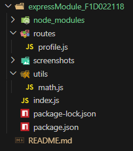
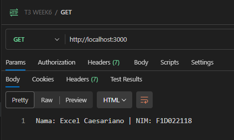
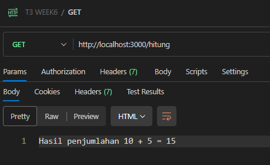
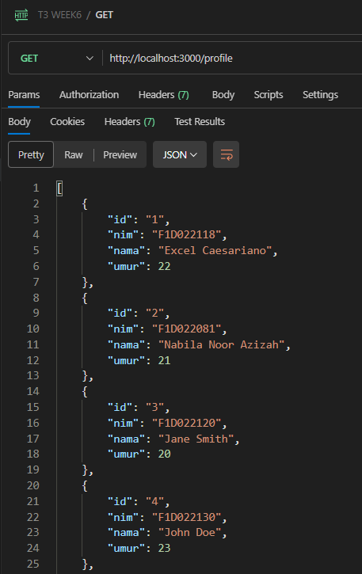
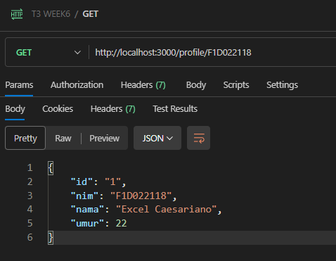
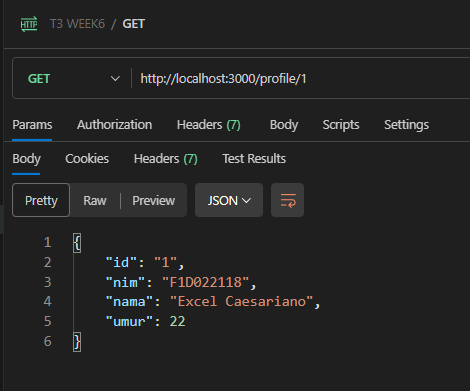

# Week 6 - Express.js & Modul Node.js

## 📌 Deskripsi
Project ini dibuat untuk memenuhi **Assignment 3** mata kuliah *Pemrograman Web Lanjut*.  
Tujuan dari tugas ini adalah agar mahasiswa memahami dasar penggunaan **Express.js** dan **modul lokal pada Node.js**, dengan membuat server sederhana yang memiliki routing modular.  

## 📂 Struktur Project



## ⚙️ Instalasi
1. Clone repository ini:
   ```bash
   git clone https://github.com/username/week6-express-module.git
2. Masuk ke folder project:
    ```bash
    cd expressModule_F1D022118
3. Install dependencies:
    ```bash
    npm install
## ▶️ Cara Menjalankan
1. Jalankan server dengan perintah:
    ```bash
    node index.js
2. Jika berhasil, terminal akan menampilkan:
    ```bash
    Server berjalan di http://localhost:3000
## 🌐 Endpoint API

1. GET /
2. GET /hitung
3. GET /profile
4. GET /profile/:nim
5. GET /profile/1

## 🧪 Testing dengan Postman

1. Pastikan server sudah berjalan (node index.js).
2. Buka Postman Desktop.
3. Buat request baru:
- Method: GET
- URL: http://localhost:3000/
4. Klik Send → lihat response dari server.
5. Ulangi untuk endpoint lain (/hitung, /profile, /profile/:nim, dan /profile/1).

## 📸 Output yang Dihasilkan
- GET / → Nama dan NIM.



- GET /hitung → Hasil penjumlahan.



- GET /profile → JSON array daftar profile.



- GET /profile/:nim → JSON detail profile sesuai NIM.



- GET /profile/1 → JSON detail profile sesuai id.

